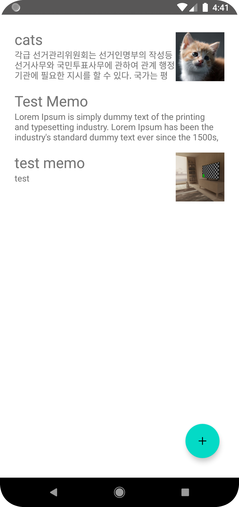

# 라인 앱 개발 챌린지 
프로그래머스에서 진행한 라인 앱 개발 챌린지 제출 자료입니다.  

## Sources
[프로그래머스_라인 앱 개발 챌린지](https://programmers.co.kr/competitions/139/2020-line-recruitment)

## 🔍  Overview

프로그래머스에서 진행한 [라인 앱 개발 챌린지](https://programmers.co.kr/competitions/139/2020-line-recruitment)의 과제로 구현한 메모 애플리케이션 입니다. 이미지 첨부가 가능한 메모 기능을 구현했습니다. **테스트 주도 개발의 싸이클을 이해하기 위해서 화면 테스트와 단위 테스트**를 번갈아가면서 프로젝트를 진행했습니다. 총 6개의 화면 테스트, 2개의 데이터 베이스 테스트와 memoViewModel에 대한 테스트 파일을 생성했습니다. **챌린지 결과로 상위1%성적을 기록했습니다.**

## 🛠 사용기술 및 언어

`kotlin` `assertJ` `mockito` `junit` `room` `rxAndroid` `rxKotlin` `rxbinding` `koin` `glide`

## 🧐  스크린샷 및 주요 기능

  

**메모 리스트 화면**

- 작성한 메모들을 볼 수 있는 화면입니다.
- 사용자가 작성한 메모를 작성한 순서대로 보여줍니다.

 

**메모 작성화면**

- 제목과 내용을 입력할 수 있습니다.
- 이미지 추가 아이콘을 클릭하여 이미지 추가 옵션을 선택할 수 있습니다.
- 첨부된 이미지는 아래 첨부 이미지 박스에 보여집니다.
- 최대 5개의 이미지를 첨부할 수 있습니다.

 

**이미지 선택 옵션 다이얼로그**

- 촬영하여 가져오기, url로 가져오기, 갤러리에서 가져오기 옵션을 선택할 수 있습니다.
- url에서 가져오기를 선택할 경우 아래에서 url 입력창이 띄어집니다.